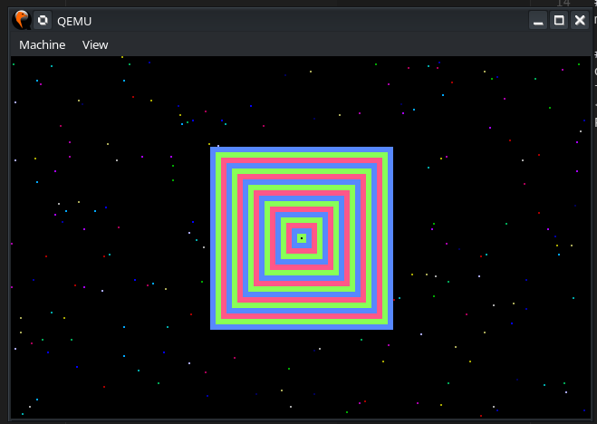

<p align="center">
  
</p>

## About
I made this as part of the systems programming module while I was at university. Written in C this project initialises and demonstrates basic graphics features in two different graphics modes requiring radically different data handling. The graphics mode allows multiple applications to write to the screen at the same time. Most of the code I wrote is in graphics.c and demo.c
<br/>
I achieved an overall grade of 87% for the module.

## Requirements
make
<br/>
qemu

## Running
```sh
make qemu
```

### Inside the VM
```sh
demo
fork
```
<br/>
Project Demo: https://youtu.be/RJbGHK947_0